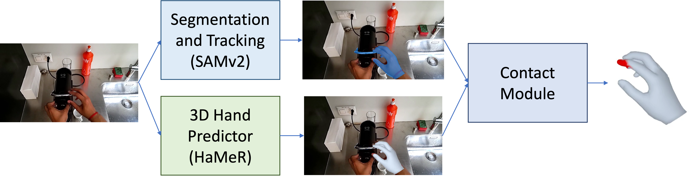

# Data Engine

<p align="center">
  
</p>

While HoloAssist contains diverse interactions, it does not provide 3D annotations for hand poses & contact points. To extract these annotations, we design a semi-automatic data pipeline using 2D segmentation masks, 3D hand poses & 2D contact region. Some examples are available on the [website](https://ap229997.github.io/projects/latentact/).

*Note that since the annotations are programmatically generated, they are not perfect. We filter out erroneous cases in several steps, although there is still some noise in the data.*

## Process videos from HoloAssist

Download the [HoloAssist](https://holoassist.github.io/) dataset. Specifically: Videos (pitch shifted), Head pose, Labels, Camera calibration, Data splits, and extract them using the instructions on their website.

Set the environment variables:
```bash
export ROOT_DIR=<path_to_latentact_repo>
export HOLO_PATH=<path_to_holoassist_videos>
```

Extract frames from the videos. This only extract frames for the subset of data that we consider in our work. The videos are processed in batches with `--start_num` and `--end_num` as indices of the video list.
```bash
python PyHoloAssist/extract_videos.py --start_num 0 --end_num 10
```

Extract action descriptions, hand information and camera parameters and save them separately to be used further. This corresponds to `holo_action_data` in [downloads](https://drive.google.com/drive/folders/1u807hfuNgN7ZvJp5C_tk9GEzwoBlk40t?usp=sharing)
```bash
python PyHoloAssist/hand_video_sync.py --start_num 0 --end_num 10 --save_action logs/debug_holo
```

## 3D Hand Predictor

We use [HaMeR](https://github.com/geopavlakos/hamer) to extract 3D hand poses from HoloAssist videos. We combine these hands with camera information to get 3D hand motion for different video clips. This corresponds to `holo_hamer_preds` in [downloads](https://drive.google.com/drive/folders/1u807hfuNgN7ZvJp5C_tk9GEzwoBlk40t?usp=sharing).

Check the HaMeR repo for installation instructions. Download the checkpoint & MANO model and place them in `_DATA` in this directory (following HaMeR repo). Register on the [MANO](https://mano.is.tue.mpg.de/) website to download hand model. Set `MANO_PATH` to the path of the MANO model in your system.

HaMeR uses ViTPose to get the 2D bounding boxes around hands for input to their model. We find ViTPose to be slow and not very accurate. Instead we use [Hands23](https://github.com/EvaCheng-cty/hands23_detector) model which is also trained on egocentric videos and is faster. We provide the estimated bounding boxes as `holo_hand_bbox` in [downloads](https://drive.google.com/drive/folders/1u807hfuNgN7ZvJp5C_tk9GEzwoBlk40t?usp=sharing). We modify the code to directly use the precomputed hand bounding boxes.

```bash
CUDA_VISIBLE_DEVICES=0 hamer/python process_holo.py --out_folder logs/debug_hamer --start_num 0 --end_num 10 --use_gt_f --sep_hands --save_hands
```

## Segmentation and Tracking

We design a semi-automatic pipline based on0 [SAMv2] for segmenting and tracking objects in contact with the hand. We first click points on the object of interest in the first frame and then use the SAMv2 model to track the object masks. The user interface used for clicking points and the clicked points are provided in `segment-anything-2-real-time/label_ui`. The obtained masks are provided as `holo_obj_masks` in [downloads](https://drive.google.com/drive/folders/1u807hfuNgN7ZvJp5C_tk9GEzwoBlk40t?usp=sharing). 

```bash
CUDA_VISIBLE_DEVICES=0 python segment-anything-2-real-time/track_holo.py --out_folder logs/debug_track --points_file segment-anything-2-real-time/label_ui/clicks.json --start_num 0 --end_num 10
```

## Comtact Module

We first compute a 2D contact region in an image as the overlap between the hand & object masks. We add gaussian noise at the boundary to obtain a dense 2D contact region. We back project the 2D contact region into 3D hand mesh to obtain 3D contact points on the hand mesh.

This script uses saved predictions from each of the previous steps.
```bash
python holo_contacts.py --out_folder logs/debug_contact --start_num 0 --end_num 10 --use_gt_f
```

## Removing Hands from images

In our experiments, we also consider a setting where hands are absent in the image. For this, we remove hands via inpainting (using [Affordance Diffusion](https://github.com/NVlabs/affordance_diffusion)). This gives us the data to train and evaluate our model. Check Affordance Diffusion repo for usage instructions.

## Acknowledgements

We build on code from several repositories. We thank the authors for their work and for making their code available. Please check their respective repos for citation, licensing and usage.

- [PyHoloAssist](https://github.com/taeinkwon/PyHoloAssist)
- [Hands23](https://github.com/EvaCheng-cty/hands23_detector)
- [HaMeR](https://github.com/geopavlakos/hamer)
- [SAMv2](https://github.com/facebookresearch/sam2)
- [segment-anything-2-real-time](https://github.com/Gy920/segment-anything-2-real-time)
- [VISOR-HOS](https://github.com/epic-kitchens/VISOR-HOS)
- [Affordance Diffusion](https://github.com/NVlabs/affordance_diffusion)
- [ARCTIC](https://github.com/zc-alexfan/arctic)